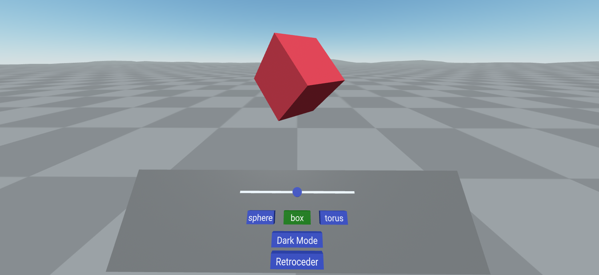
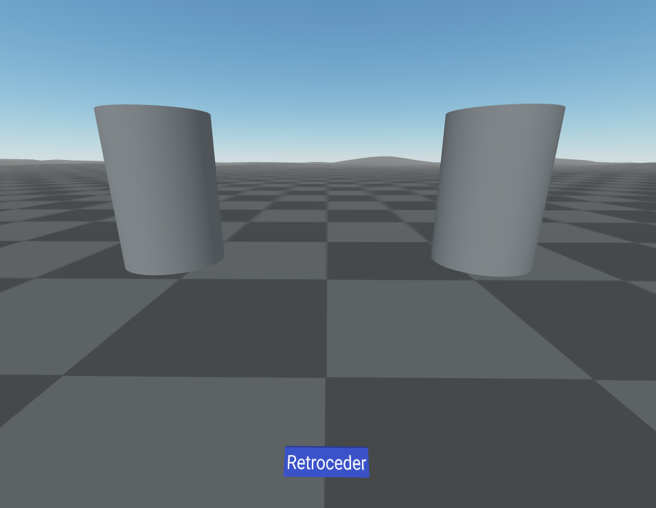

## Hand-tracking Con gestos
Se ha utilizado como escenario base el ejemplo ubicado en examples/showcase/hand-tracking y se ha modificado para que permita agarrar objetos con el gesto "Pinch" a través del componente hand-tracking-grab-controls que implementa la detección de el gesto "Pinch" además de implementar el componente grabbable, que se puede agregar a cualquier entidad para que se pueda agarrar.

Además se ha agregado una escena nueva que permite la posibilidad de realizar gestos como "Thums_up", "Shaka", "One", "Two" y "Rock", estos realizarán un cambio de color corespondientemente de cada gesto que se haga.
<br/><br/><br/>
Para iniciar el proyecto en la carpeta raíz hay que usar el siguiente comando:
```npx vite```

##
Interfaz de la página Hand-tracking (Agarrar objetos):

Se puede seleccionar a través de los botones el objeto que se quiere mostrar y se puede modificar su posición agarrando el objeto.
##
Interfaz de la página Hand-tracking-gestures

Se pueden realizar los gestos nombrados anteriormente para cambiar el color de los cilindros, cada uno cambia dependiendo de la mano con la que se realice el gesto.
